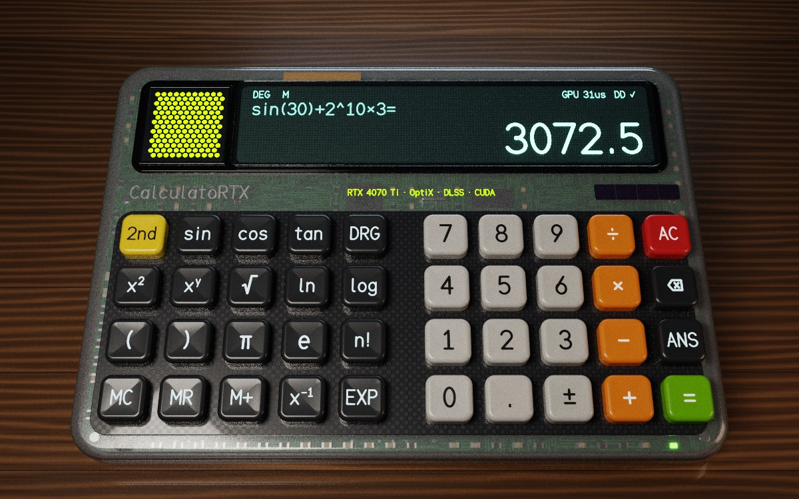

# CalculatoRTX

Calculatrice scientifique **entièrement ray tracée** en CUDA C++ : chaque pixel de l'interface
(coque translucide et électronique visible au travers, touches, légendes en relief, chiffres de
l'afficheur, vitre, bureau, arrière-plan)
est calculé par **path tracing OptiX sur les RT cores**, suréchantillonné par **NVIDIA DLSS**
(Tensor cores), et **tous les calculs mathématiques sont exécutés sur la carte graphique**.

Compatible **Linux** (CachyOS/Arch, Ubuntu…) et **Windows 10/11**.

> **État du projet.** Sous Linux (GCC 13, CUDA 13.4, OptiX 9.1 et 9.0, SDK DLSS 310.9.1,
> Vulkan 1.3, GLFW 3.3), le projet se compile et s'édite de bout en bout sans avertissement, avec
> et sans DLSS, et les tests unitaires du moteur de calcul passent. **Non testé** : la compilation
> Windows (MSVC) et l'exécution sur une vraie carte RTX (aucun GPU dans l'environnement de
> développement). La section [Dépannage](#dépannage) décrit les points à vérifier au premier
> lancement.



*Image de référence calculée **sur CPU** pendant le développement par un portage du path tracer
de `Programs.cu` (mêmes matériaux, même scène, 320 échantillons par pixel, sans DLSS ni
débruiteur). Ce n'est pas une capture de l'application : sur la RTX 4070 Ti, la même image est
produite en temps réel par OptiX, puis débruitée et suréchantillonnée par le DLSS.*

---

## Sommaire

1. [Fonctionnalités](#fonctionnalités)
2. [Utilisation des capacités de la RTX 4070 Ti](#utilisation-des-capacités-de-la-rtx-4070-ti)
3. [Prérequis](#prérequis)
4. [Compilation](#compilation)
5. [Utilisation](#utilisation)
6. [Architecture](#architecture)
7. [Dépannage](#dépannage)
8. [Licences](#licences)

---

## Fonctionnalités

### Interface 100 % ray tracée

Il n'y a aucun élément 2D : l'interface est une scène 3D (~105 000 triangles, 118 instances).

| Élément | Ce que calculent les rayons |
|---|---|
| Pourtour de la coque (flancs, rebords, bandeau du logo) en polycarbonate gris translucide, creux | double réfraction à travers la paroi dépolie (microfacettes GGX), absorption de Beer-Lambert dans l'épaisseur, diffusion laiteuse qui garde la teinte grise |
| Électronique interne : circuit imprimé (pistes et vias procéduraux), dômes de contact, processeur, quartz, mémoire, composants CMS, condensateurs, nappe Kapton, pile, LED témoin | vue en transparence, légèrement estompée ; éclairée par la lumière qui traverse la coque, ombres comprises |
| Lit de touches en carbone, cadre de l'afficheur | plaques opaques enchâssées dans la coque : réflexions GGX, ombres douces, éclairage global |
| Calculatrice inclinée de 15° sur une béquille en aluminium brossé et deux patins | l'écran fait face à l'utilisateur ; toute la scène est posée dans un repère incliné |
| 40 touches arrondies à face concave | géométrie instanciée, vernis (clear-coat), animation d'appui |
| Légendes des touches, texte de l'afficheur | **vrais volumes 3D** extrudés à partir d'une police vectorielle (pas de texture) |
| Afficheur fluorescent (VFD) | chiffres émissifs qui éclairent la scène, sous une **vitre réfractive** (Fresnel exact) |
| Grille perforée + bande lumineuse verte | trous hexagonaux via **Opacity Micromaps** + programme any-hit |
| Cellule solaire (étroite, à droite), marquage, bureau en noyer verni | matériaux procéduraux évalués dans le shader |
| Arrière-plan « studio » | environnement HDR généré sur GPU, échantillonné par les unités de texture |
| Luminaires (softbox, contre-jour, appoint) | géométrie émissive + échantillonnage direct avec MIS |
| Survol / clic | **sélection par lancer de rayon** sous le curseur |

Le rendu fait jusqu'à 5 rebonds (réglable), sans compter les traversées de verre et de
plastique (8 au plus en plus, pour que l'électronique vue à travers la coque reste éclairée),
avec roulette russe, et fournit au DLSS la
profondeur et les vecteurs de mouvement (y compris ceux des touches qui s'enfoncent).

### Calculs sur le GPU

Le CPU ne fait **aucun calcul numérique** : il transmet au GPU l'expression saisie sous forme
d'octets. Un warp CUDA :

1. analyse l'expression (tokenisation + algorithme *shunting-yard* → notation polonaise inverse),
   y compris la conversion des nombres décimaux ;
2. l'évalue **en parallèle dans quatre arithmétiques** : double-double (~31 chiffres
   significatifs), FP64, FP32 et **arithmétique d'intervalles** FP64 à arrondis dirigés
   (`__dadd_rd`, `__dmul_ru`…) ;
3. croise les résultats par échanges intra-warp (`__shfl_sync`) : l'indicateur `DD ✓` de
   l'afficheur signifie que le résultat double-double est dans l'intervalle garanti et
   concorde avec FP64 ;
4. formate le résultat en texte décimal (arrondi correct, notation ×10ⁿ) — toujours sur GPU.

Fonctions : `+ − × ÷`, puissance, racine n-ième, `√ ∛ x² x³ x⁻¹ n!`, `sin cos tan` et leurs
réciproques (degrés/radians, valeurs exactes aux angles remarquables), `ln log eˣ 10ˣ`, `π e`,
parenthèses, multiplication implicite (`2π`, `3(4+5)`), notation `EXP`, `ANS`, mémoire
`MC MR M+ M−` (l'addition mémoire est elle aussi faite par le GPU), **aperçu du résultat en
direct** pendant la saisie. Le calcul tourne sur un flux CUDA **haute priorité**, prioritaire
sur le rendu.

---

## Utilisation des capacités de la RTX 4070 Ti

La RTX 4070 Ti (puce AD104, architecture Ada Lovelace, `sm_89`) est exploitée ainsi :

| Capacité matérielle | Utilisation dans CalculatoRTX | Fichier |
|---|---|---|
| **RT cores 3ᵉ génération** | traversée BVH et intersections triangles de tous les rayons (OptiX 9) | `src/render/device/Programs.cu` |
| **Shader Execution Reordering** (Ada) | `optixTraverse` + `optixReorder` : regroupement des threads par matériau avant le shading | `Programs.cu` |
| **Opacity Micromaps** (Ada) | grille perforée : 512 triangles × 1 024 micro-triangles classés sur l'hôte, any-hit seulement pour les zones indéterminées | `OptixRenderer.cpp`, `Grille.h` |
| **Tensor cores 4ᵉ génération** | DLSS Super Resolution (modèle Transformer, presets DLSS 4) + débruiteur IA OptiX | `src/dlss/`, `OptixRenderer.cpp` |
| **Instancing matériel** (IAS/GAS) | un seul maillage de touche instancié 40 fois, compaction des BVH | `OptixRenderer.cpp` |
| **CUDA cores / FP32** | shading, bruit procédural, post-traitement (bloom, ACES, tramage) | `Kernels.cu` |
| **Unités FP64 + FMA** | arithmétique double-double et intervalles à arrondis dirigés | `src/calc/` |
| **Warps / groupes coopératifs** | analyse + 4 évaluations concurrentes + réduction par `shfl` | `CalcEngine.cu` |
| **Cache L2 de 48 Mo** | fenêtre d'accès « persistante » sur les images produites par le path tracer et relues par le débruiteur | `OptixRenderer.cpp` |
| **CUDA Graphs** | chaîne de post-traitement capturée une fois, rejouée à chaque image | `Kernels.cu` |
| **Priorités de flux** | calculs de la calculatrice sur un flux prioritaire | `CalcEngine.cu` |
| **Unités de texture** | environnement HDR en `cudaArray` avec filtrage bilinéaire matériel | `OptixRenderer.cpp` |
| **FP16** | tampons RGBA16F d'entrée/sortie du DLSS | `Kernels.cu` |
| **Interopérabilité CUDA ↔ Vulkan** | mémoire externe partagée (zéro copie) + sémaphore *timeline* exporté | `src/gpu/VulkanContext.cpp` |

**Ce qui n'est pas utilisé, et pourquoi** (utiliser « toutes » les fonctions d'une carte n'a pas
de sens pour chacune d'elles) :

- **DLSS Frame Generation** (accélérateur de flux optique) : nécessite le SDK Streamline + Reflex,
  uniquement sous Windows ; il n'existe pas de chemin CUDA/Vulkan Linux.
- **DLSS Ray Reconstruction** : possible évolution ; ici le débruitage est fait par le débruiteur
  IA d'OptiX (également sur Tensor cores) avant la super-résolution DLSS.
- **Displaced Micro-Meshes** : la géométrie (touches arrondies) est générée analytiquement avec
  une densité suffisante, il n'y a pas de surface déplacée à encoder.
- **NVENC / NVDEC** (encodage vidéo AV1) : sans rapport avec une calculatrice.

---

## Prérequis

### Matériel et pilote

- GPU NVIDIA **RTX** (conçu et optimisé pour la RTX 4070 Ti ; fonctionne sur toute RTX 20/30/40/50,
  SER et OMM étant accélérés à partir des RTX 40).
- **Pilote NVIDIA récent** : il doit supporter la version du CUDA Toolkit utilisée (voir
  `nvidia-smi`, ligne « CUDA Version ») et OptiX 9.1. Le pilote fournit aussi OptiX
  (`libnvoptix` / `nvoptix.dll`) et le cœur NGX du DLSS.

### CachyOS / Arch Linux

```bash
./scripts/install_deps_cachyos.sh
# équivalent à :
sudo pacman -S --needed base-devel git cmake ninja cuda vulkan-headers vulkan-icd-loader vulkan-tools glfw
```

Rechargez ensuite le shell (le paquet `cuda` ajoute `/opt/cuda/bin` au `PATH` via
`/etc/profile.d/cuda.sh`).

### Windows 10/11

- Visual Studio 2022 avec la charge de travail « Développement Desktop en C++ »
- CUDA Toolkit 12.4 ou plus récent (13.x recommandé)
- SDK Vulkan LunarG (<https://vulkan.lunarg.com/>)
- CMake 3.24+ et Git

### Dépendances téléchargées automatiquement

Au premier `cmake` (connexion Internet requise), si elles ne sont pas déjà installées :

| Dépendance | Source | Remarque |
|---|---|---|
| En-têtes OptiX 9.1 | `github.com/NVIDIA/optix-dev` (tag `v9.1.0`) | la bibliothèque OptiX elle-même est dans le pilote |
| SDK DLSS 310.9.1 | `github.com/NVIDIA/DLSS` (tag `v310.9.1`) | quelques centaines de Mo ; la bibliothèque d'exécution est copiée à côté de l'exécutable |
| GLFW 3.4 | `github.com/glfw/glfw` | seulement si GLFW n'est pas installé |

---

## Compilation

### CachyOS / Linux (recommandé)

```bash
git clone https://github.com/DurianTheWAV/CalculatoRTX.git
cd CalculatoRTX
./scripts/build_linux.sh
./build/linux-release/bin/CalculatoRTX
```

Le script trouve `nvcc` (`/opt/cuda`), choisit le compilateur hôte compatible fourni par le
paquet `cuda` (Arch livre souvent un GCC plus récent que ce que `nvcc` accepte), configure,
compile et lance les tests.

Équivalent manuel :

```bash
cmake --preset linux-release          # ou : cmake -S . -B build -G Ninja -DCMAKE_BUILD_TYPE=Release
cmake --build --preset linux-release
ctest --preset linux-release
```

### Windows

```bat
scripts\build_windows.bat
build\windows\bin\Release\CalculatoRTX.exe
```

ou ouvrez le dossier dans Visual Studio 2022 (support CMake intégré, preset `windows-release`).

### Options CMake

| Option | Défaut | Rôle |
|---|---|---|
| `CRTX_ENABLE_DLSS` | `ON` | intègre DLSS (sinon : rendu natif + accumulation + débruiteur IA) |
| `DLSS_SDK_DIR` | vide | SDK DLSS déjà téléchargé (évite le téléchargement) |
| `OptiX_INSTALL_DIR` | vide | SDK OptiX installé (8.0 minimum) ; sinon en-têtes officiels téléchargés |
| `CRTX_OPTIX_GIT_TAG` | `v9.1.0` | version des en-têtes OptiX téléchargés (`v9.0.0` pour un pilote plus ancien) |
| `CMAKE_CUDA_ARCHITECTURES` | `89` | code machine généré (89 = Ada / RTX 40 ; `86;89` pour ajouter les RTX 30) |
| `CRTX_PTX_ARCH` | `89` | architecture du PTX OptiX (`75` pour supporter aussi les RTX 20/30) |
| `CRTX_DLSS_DEV_RUNTIME` | `OFF` | bibliothèque DLSS de développement (surimpression de débogage) |
| `CRTX_BUILD_TESTS` | `ON` | tests CPU du moteur de calcul |
| `CRTX_FETCH_DEPS` | `ON` | autorise les téléchargements automatiques |

---

## Utilisation

### Souris

| Action | Effet |
|---|---|
| clic gauche sur une touche | appui (touche détectée par un rayon lancé sous le curseur) |
| glisser (clic gauche hors touche, droit ou milieu) | faire tourner la vue |
| molette | zoom |
| `Origine` (Home) | recentrer la caméra |

### Clavier

| Touche | Fonction | Touche | Fonction |
|---|---|---|---|
| `0`–`9` `.` | chiffres | `+ - * / ^` | opérateurs |
| `(` `)` | parenthèses | `!` | factorielle |
| `Entrée` / `=` | calculer | `Retour arrière` | effacer |
| `Échap` / `Suppr` | AC | `Tab` | 2nd |
| `s` `c` `t` | sin cos tan | `l` `g` | ln log |
| `r` | racine | `q` | x² |
| `i` | x⁻¹ | `p` `e` | π, e |
| `E` | EXP | `a` | ANS |
| `n` | ± | `d` | DEG/RAD |
| `m` / `M` | MR / M+ | `F1` | aide |

| Touche | Réglage de rendu |
|---|---|
| `F2` | DLSS activé / désactivé |
| `F3` | mode DLSS : DLAA → Qualité → Équilibré → Performance → Ultra Performance |
| `F4` | débruiteur IA OptiX |
| `F5` | Shader Execution Reordering (comparer les performances) |
| `F6` | V-Sync |
| `F7` / `F8` | rebonds max (2/3/5/8) / échantillons par pixel (1/2/4) |
| `F9` / `F10` | exposition − / + |

La barre de titre affiche le mode, la résolution de rendu et d'affichage, les images/s et les
temps GPU du path tracing et du débruiteur. La console affiche le détail de chaque calcul GPU
(double-double, FP64, FP32, intervalle, temps en µs).

### Ligne de commande

```
CalculatoRTX [--no-dlss] [--dlss-mode=dlaa|quality|balanced|performance|ultra]
             [--size=1600x1000] [--no-vsync] [--device=0] [--validation]
```

---

## Architecture

### Déroulement d'une image

```
            CPU                       CUDA (flux de rendu)                    Vulkan (file graphique)
 ┌──────────────────────┐  ┌──────────────────────────────────────┐  ┌──────────────────────────────┐
 │ saisie → programme   │  │ reconstruction BVH (texte modifié)   │  │                              │
 │ calcul GPU (flux     │  │ IAS (animations des touches)         │  │                              │
 │ haute priorité)      │  │ OptiX : path tracing + SER + OMM     │  │                              │
 │ animation, caméra    │  │ OptiX : rayon de sélection (souris)  │  │                              │
 │                      │  │ débruiteur IA (Tensor cores)         │  │                              │
 │                      │  │ couleur→RGBA16F, profondeur, vecteurs│  │                              │
 │                      │  │ ── signal timeline (n+1) ──────────► │  │ copies tampons → images      │
 │                      │  │                                      │  │ DLSS Super Resolution (NGX)  │
 │                      │  │ ◄───────── attente timeline (n+2) ── │  │ copie image → tampon partagé │
 │                      │  │ post-traitement (CUDA Graph) :       │  │                              │
 │                      │  │ bloom, ACES, vignettage, sRGB        │  │                              │
 │                      │  │ ── signal timeline (n+3) ──────────► │  │ copie → swapchain, présente  │
 └──────────────────────┘  └──────────────────────────────────────┘  └──── signal timeline (n+4) ───┘
```

Vulkan ne dessine rien : il sert uniquement à présenter l'image et à fournir au DLSS les
ressources Vulkan qu'il exige (le chemin DLSS officiel est D3D11/D3D12/Vulkan). Les images
circulent sans copie par le CPU grâce à la mémoire externe partagée entre CUDA et Vulkan.

Sans DLSS (GPU non RTX, SDK absent, `F2`), l'image est rendue en résolution native avec
accumulation progressive des échantillons (anticrénelage par jitter aléatoire) puis débruitée.

### Arborescence

```
CMakeLists.txt, CMakePresets.json   build multiplateforme (téléchargement des dépendances)
cmake/EmbedFile.cmake               intègre le PTX OptiX dans l'exécutable
scripts/                            installation / compilation CachyOS et Windows
src/main.cpp                        point d'entrée, options de ligne de commande
src/app/App.*                       fenêtre, boucle de rendu, synchronisation CUDA↔Vulkan, entrées
src/app/CalculatorController.*      logique de saisie (texte uniquement, aucun calcul CPU)
src/calc/DoubleDouble.cuh           arithmétique double-double (exp, log, trigo, racines…)
src/calc/CalcCore.cuh               analyseur, 4 arithmétiques, formatage décimal (GPU + tests CPU)
src/calc/CalcEngine.cu              kernel warp + interface hôte
src/render/device/Programs.cu       programmes OptiX : raygen (path tracer SER), pick, any-hit
src/render/device/Shading.cuh       BSDF (Lambert + GGX + vernis), diélectrique dépoli, Fresnel, motifs procéduraux
src/render/OptixRenderer.*          pipeline, SBT, GAS/IAS, OMM, débruiteur IA, cache L2
src/render/Kernels.*                environnement HDR, conversion FP16, post-traitement (CUDA Graph)
src/render/Grille.h                 fonction de distance des trous (OMM + any-hit)
src/scene/StrokeFont.*              police vectorielle (glyphes en traits)
src/scene/Mesh.*                    maillages procéduraux : pavés arrondis, texte extrudé, grilles
src/scene/CalculatorScene.*         calculatrice complète : coque, électronique, béquille, touches, afficheur, matériaux, lumières
src/gpu/VulkanContext.*             instance, périphérique, swapchain, mémoire/sémaphores exportés
src/dlss/DlssUpscaler.*             intégration NGX DLSS (repli automatique si indisponible)
tests/CalcHostTest.cu               tests du moteur de calcul exécutés sur CPU
```

---

## Dépannage

**`nvcc` refuse le compilateur (« unsupported GNU version »)** — Arch/CachyOS livrent souvent un
GCC plus récent que celui supporté par `nvcc`. Le paquet `cuda` fournit la bonne version :

```bash
export CUDAHOSTCXX=/usr/bin/g++-14     # adaptez au GCC installé par le paquet cuda
./scripts/build_linux.sh
```

En dernier recours : `-DCMAKE_CUDA_FLAGS=-allow-unsupported-compiler`.

**`OPTIX_ERROR_UNSUPPORTED_ABI_VERSION` au lancement** — le pilote est plus ancien que les en-têtes
OptiX 9.1 : mettez le pilote à jour, ou reconfigurez avec `-DCRTX_OPTIX_GIT_TAG=v9.0.0`.

**Erreur PTX « Unsupported .version »** — le pilote est plus ancien que le CUDA Toolkit : la ligne
« CUDA Version » de `nvidia-smi` doit être ≥ la version de `nvcc`. Mettez le pilote à jour.

**« DLSS non disponible »** (repli automatique en rendu natif) — vérifiez que
`libnvidia-ngx-dlss.so.*` (Linux) ou `nvngx_dlss.dll` (Windows) est bien à côté de l'exécutable
(copie automatique après compilation) et que `nvidia-smi` fonctionne. Journal NGX détaillé :
`__NGX_LOG_LEVEL=1 ./CalculatoRTX` ; indicateur DLSS à l'écran : `__NGX_SHOW_INDICATOR=1`.

**Image DLSS floue ou qui tremble** — compilez avec `-DCRTX_DLSS_DEV_RUNTIME=ON` pour afficher la
surimpression de débogage DLSS (vecteurs de mouvement, jitter), et essayez
`CRTX_DLSS_JITTER_SIGN=-1 ./CalculatoRTX` pour inverser la convention du jitter.

**Erreurs Vulkan** — relancez avec `--validation` (nécessite `vulkan-validation-layers`) pour
obtenir des messages détaillés.

**Performances** — `F3` (mode DLSS Performance), `F7` (moins de rebonds) ; `F5` permet de mesurer
le gain du Shader Execution Reordering.

---

## Licences

- Code de CalculatoRTX : licence MIT (voir `LICENSE`).
- En-têtes OptiX et SDK DLSS : propriété de NVIDIA, distribués sous leurs licences respectives ;
  ils ne sont **pas** inclus dans ce dépôt mais téléchargés au moment de la configuration. La
  bibliothèque d'exécution DLSS copiée à côté de l'exécutable doit être redistribuée selon les
  conditions du SDK DLSS de NVIDIA (voir le dossier du SDK, section « Distributable Libraries » du
  guide de programmation).
- GLFW : licence zlib.

NVIDIA, RTX, DLSS, OptiX et CUDA sont des marques de NVIDIA Corporation. Ce projet n'est pas
affilié à NVIDIA.
