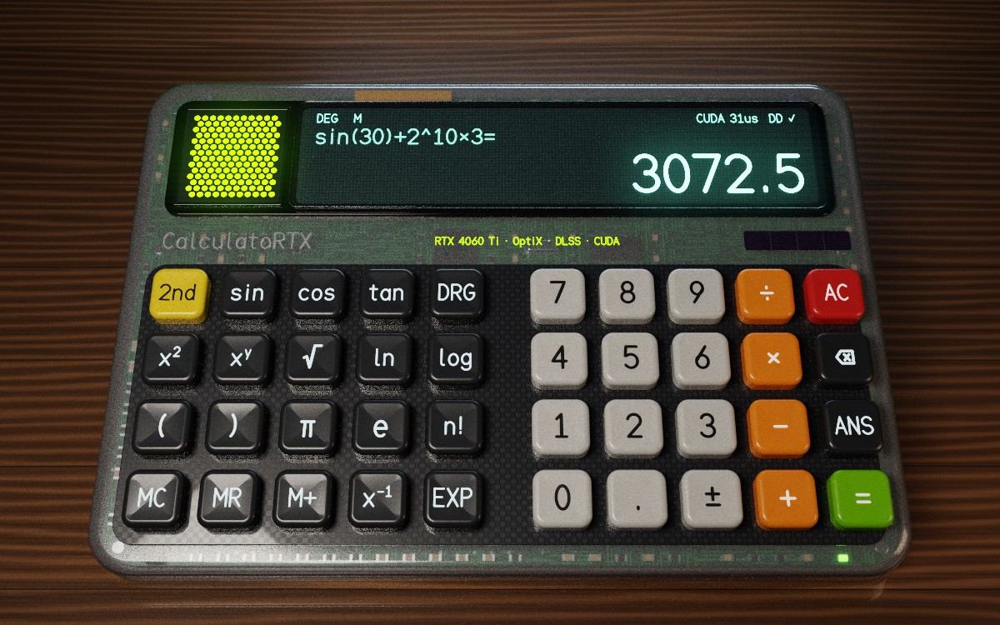

# CalculatoRTX

A scientific calculator that is **fully ray traced**: every pixel of the interface (translucent
shell with the electronics visible through it, keys, embossed legends, display digits, glass,
desk, background) is computed by a **GPU path tracer**, and **all mathematical calculations run
on the graphics card**.

Two rendering back-ends are built from the same scene:

| Back-end | GPUs | Ray tracing | Upscaling / denoising | Calculator engine |
|---|---|---|---|---|
| **NVIDIA** | GeForce RTX (tuned for the **RTX 4060 Ti**) | OptiX 9 on the RT cores, Shader Execution Reordering, Opacity Micromaps | **DLSS** Super Resolution + OptiX AI denoiser (Tensor cores) | CUDA warp |
| **Vulkan** | **AMD Radeon RX 6000/7000/9000**, Intel Arc, NVIDIA RTX | `VK_KHR_ray_query` in compute shaders (hardware ray accelerators) | temporal accumulation + edge-avoiding à-trous denoiser + **AMD FidelityFX FSR 1** | FP64 compute shader |

The NVIDIA back-end is used when an RTX card and the CUDA toolkit are available; otherwise the
program uses the Vulkan back-end automatically. The CUDA toolkit is **optional** at build time:
without it, only the Vulkan back-end is compiled (AMD / Intel machines).

Runs on **Linux** (CachyOS/Arch, Ubuntu…) and **Windows 10/11**.

> **Project status.** On Linux (GCC 13, CUDA 13.4, OptiX 9.1 and 9.0, DLSS SDK 310.9.1,
> Vulkan 1.3, GLFW 3.3), both configurations (with and without CUDA) build without warnings, and
> the test suite passes. The Vulkan back-end has been run end to end on Mesa's software Vulkan
> driver (*lavapipe*): rendering, picking, FSR 1, temporal accumulation, and 1 500+ random
> expressions evaluated by the GPU calculator engine and compared with the CPU reference.
> **Not tested**: the Windows (MSVC) build and execution on real NVIDIA or AMD hardware (there
> is no GPU in the development environment). See [Troubleshooting](#troubleshooting) for what to
> check on first launch.



*Rendered by the program's own Vulkan back-end (`render_vulkan_test`, 1200×750, ~260
accumulated frames, à-trous denoiser, bloom and ACES tone mapping) on the lavapipe software
driver during development. It is not a capture from a GPU: on an RTX 4060 Ti the NVIDIA
back-end produces this image in real time with OptiX and DLSS, and on a Radeon the Vulkan
back-end produces the same image.*

---

## Contents

1. [Features](#features)
2. [Optimisations for the RTX 4060 Ti](#optimisations-for-the-rtx-4060-ti)
3. [AMD and Intel GPUs (Vulkan back-end)](#amd-and-intel-gpus-vulkan-back-end)
4. [Requirements](#requirements)
5. [Building](#building)
6. [Usage](#usage)
7. [Architecture](#architecture)
8. [Tests](#tests)
9. [Troubleshooting](#troubleshooting)
10. [Licences](#licences)

---

## Features

### 100 % ray-traced interface

There are no 2D elements: the interface is a 3D scene (~105,000 triangles, 118 instances).

| Element | What the rays compute |
|---|---|
| Shell rim (sides, edges, logo band) in hollow translucent grey polycarbonate | double refraction through the frosted wall (GGX microfacets), Beer-Lambert absorption through the thickness, milky scattering that keeps the grey tint |
| Internal electronics: printed circuit board (procedural traces and vias), contact domes, processor, crystal, memory, SMD parts, capacitors, Kapton ribbon, battery, indicator LED | seen through the shell, slightly blurred; lit by the light that crosses the shell, shadows included |
| Carbon key bed, display frame | opaque plates set into the shell: GGX reflections, soft shadows, global illumination |
| Calculator tilted by 15° on a brushed-aluminium kickstand and two feet | the display faces the user; the whole calculator lives in a tilted frame |
| 40 rounded keys with concave tops | instanced geometry, clear coat, press animation |
| Key legends, display text | **real 3D volumes** extruded from a vector stroke font (no textures) |
| Vacuum fluorescent display (VFD) | emissive digits that light the scene, under a **refractive glass** (exact Fresnel) |
| Perforated grille + green light strip | hexagonal holes through **Opacity Micromaps** + any-hit program (NVIDIA), or an alpha test on ray-query candidates (Vulkan) |
| Solar cell (narrow, on the right), branding, varnished walnut desk | procedural materials evaluated in the shader |
| "Studio" background | HDR environment generated on the GPU |
| Lights (softbox, rim light, fill light) | emissive geometry + next-event estimation with multiple importance sampling |
| Hover / click | **ray-cast picking** under the mouse cursor |

Paths have up to 5 bounces (adjustable), not counting glass and plastic crossings (up to 8
more, so that the electronics seen through the shell stays lit), with Russian roulette. The path
tracer also outputs depth and motion vectors (including those of keys being pressed) for DLSS
and for the temporal accumulation of the Vulkan back-end.

### Calculations on the GPU

The CPU does **no numerical computation**: it sends the typed expression to the GPU as bytes.
A CUDA warp (NVIDIA) or a four-lane compute shader workgroup (Vulkan):

1. parses the expression (tokenisation + *shunting-yard* → reverse Polish notation), including
   the conversion of decimal numbers;
2. evaluates it **in parallel in four arithmetics**: double-double (~31 significant digits), FP64,
   FP32 and FP64 **interval arithmetic** with directed rounding (`__dadd_rd`, `__dmul_ru`… in
   CUDA; exactness-aware emulation with error-free transformations in GLSL);
3. cross-checks the results between lanes: the `DD ✓` indicator on the display means that the
   double-double result lies inside the guaranteed interval and agrees with FP64;
4. formats the result as decimal text (correct rounding, ×10ⁿ notation) — still on the GPU.

Functions: `+ − × ÷`, power, n-th root, `√ ∛ x² x³ x⁻¹ n!` (Γ function for non-integers),
`sin cos tan` and their inverses (degrees/radians, exact values at notable angles),
`ln log eˣ 10ˣ`, `π e`, parentheses, implicit multiplication (`2π`, `3(4+5)`), `EXP` notation,
`ANS`, memory `MC MR M+ M−` (the memory addition is also done by the GPU), and a **live preview
of the result** while typing. On NVIDIA the calculation runs on a **high-priority CUDA stream**
that takes precedence over rendering.

---

## Optimisations for the RTX 4060 Ti

The RTX 4060 Ti (AD106 chip, Ada Lovelace, `sm_89`: 34 SMs, 34 third-generation RT cores,
136 fourth-generation Tensor cores, 32 MB of L2 cache, 128-bit memory bus) has a little under
60 % of the ray-tracing throughput of an RTX 4070 Ti and a narrower memory bus, so the renderer avoids doing
work it does not need:

| Technique | Effect | File |
|---|---|---|
| **Hybrid progressive rendering** | while the camera, a key or the display changes, frames are rendered at reduced resolution and reconstructed by DLSS; as soon as the image is still, samples accumulate at **native resolution** and replace the DLSS image after 4 frames | `src/backends/NvidiaBackend.cpp` |
| **Automatic DLSS mode** by display size and SM count | 34 SMs: Quality up to 1080p, Balanced at 1440p, Performance at 4K (one step better from 56 SMs, one step worse below 30) | `NvidiaBackend.cpp` |
| **Adaptive samples per pixel** when still | the sample count per frame is adjusted to keep the path-tracing time around 12 ms | `NvidiaBackend.cpp` |
| **Stop when converged** | after 1,024 samples per pixel the GPU stops ray tracing (only the picking ray is cast) and the application waits for input events instead of spinning: zero GPU load on an idle calculator | `NvidiaBackend.cpp`, `src/app/App.cpp` |
| **AI denoiser skipped** once enough samples are accumulated (≥ 256 spp) | saves Tensor-core time and avoids over-smoothing the converged image | `src/render/OptixRenderer.cpp` |
| **Persistent L2 window** sized from the actual L2 (32 MB on AD106) | the path-tracer outputs read back by the denoiser stay in L2, which compensates for the 128-bit bus | `OptixRenderer.cpp` |
| **Separate motion/still targets** | each target has its own buffers and denoiser state: switching between DLSS and native accumulation does not reallocate anything | `OptixRenderer.cpp` |

It also uses the rest of the Ada feature set:

| Hardware feature | Use in CalculatoRTX | File |
|---|---|---|
| **3rd-gen RT cores** | BVH traversal and ray/triangle intersection of all rays (OptiX 9) | `src/render/device/Programs.cu` |
| **Shader Execution Reordering** (Ada) | `optixTraverse` + `optixReorder`: threads are regrouped by material before shading | `Programs.cu` |
| **Opacity Micromaps** (Ada) | perforated grille: 512 triangles × 1,024 micro-triangles classified on the host, any-hit only in undetermined areas | `OptixRenderer.cpp`, `Grille.h` |
| **4th-gen Tensor cores** | DLSS Super Resolution (Transformer model, DLSS 4 presets) + OptiX AI denoiser | `src/dlss/`, `OptixRenderer.cpp` |
| **Hardware instancing** (IAS/GAS) | a single key mesh instanced 40 times, compacted BVHs | `OptixRenderer.cpp` |
| **CUDA cores / FP32** | shading, procedural noise, post-processing (bloom, ACES, dithering) | `Kernels.cu` |
| **FP64 units + FMA** | double-double arithmetic and directed-rounding intervals | `src/calc/` |
| **Warps / cooperative groups** | parsing + 4 concurrent evaluations + `shfl` reduction | `CalcEngine.cu` |
| **CUDA Graphs** | post-processing chain captured once, replayed every frame | `Kernels.cu` |
| **Stream priorities** | calculator work on a high-priority stream | `CalcEngine.cu` |
| **Texture units** | HDR environment in a `cudaArray` with hardware bilinear filtering | `OptixRenderer.cpp` |
| **FP16** | RGBA16F DLSS input/output buffers | `Kernels.cu` |
| **CUDA ↔ Vulkan interop** | shared external memory (zero copy) + exported timeline semaphore | `src/gpu/VulkanContext.cpp` |

**Not used, and why** (using "every" feature of a card makes no sense for each of them):

- **DLSS Frame Generation** (optical flow accelerator): requires the Streamline SDK + Reflex, on
  Windows only; there is no CUDA/Vulkan path on Linux. It would also add latency to a UI.
- **DLSS Ray Reconstruction**: a possible evolution; here denoising is done by the OptiX AI
  denoiser (also on Tensor cores) before DLSS super resolution.
- **Displaced Micro-Meshes**: the geometry (rounded keys) is generated analytically with enough
  density; there is no displaced surface to encode.
- **NVENC / NVDEC** (AV1 video encoding): unrelated to a calculator.

The build targets `sm_89` by default, so it also runs unchanged on every RTX 40 card; see
`CMAKE_CUDA_ARCHITECTURES` / `CRTX_PTX_ARCH` below for RTX 20/30.

---

## AMD and Intel GPUs (Vulkan back-end)

The Vulkan back-end is a port of the same path tracer, materials and calculator engine to GLSL
compute shaders, so the picture and the results are the same as on NVIDIA:

| Stage | Implementation | File |
|---|---|---|
| Acceleration structures | one BLAS per mesh (batched builds, rebuilt only when a mesh changes), TLAS rebuilt every frame for the key animations | `src/vk/VkRenderer.cpp` |
| Path tracing | inline ray tracing (`rayQueryEXT`) in a compute shader, buffer device addresses, scalar block layout | `src/vk/shaders/PathTrace.comp` |
| Picking | the same shader compiled with `CRTX_PICK`, one ray under the cursor | `PathTrace.comp` |
| Temporal accumulation (motion) | reprojection with motion vectors, depth disocclusion test, 3×3 neighbourhood clamp, up to 10 frames | `Temporal.comp` |
| Denoising | edge-avoiding à-trous wavelet filter guided by albedo, normal and depth; fewer passes as samples accumulate | `Denoise.comp` |
| Post-processing | bloom, exposure, vignette, ACES, sRGB, dithering | `Bloom.comp`, `Composite.comp`, `Pack.comp` |
| Upscaling (motion) | **AMD FidelityFX FSR 1** EASU + RCAS (MIT, vendored in `third_party/fsr1`) | `Fsr.comp` |
| Calculator | FP64 compute shader (double-double, FP64, FP32, intervals on four lanes) | `Calc.comp`, `CalcDD.glsl` |

The same hybrid strategy as on NVIDIA is used: reduced resolution + temporal accumulation +
FSR 1 while moving (Quality ×1.5 up to 1080p, Balanced ×1.7 at 1440p, Performance ×2 at 4K),
native progressive accumulation when still, adaptive samples per pixel, and no GPU work once
the image has converged.

Requirements: Vulkan 1.2 with `VK_KHR_acceleration_structure`, `VK_KHR_ray_query`,
`bufferDeviceAddress`, `scalarBlockLayout` and `shaderInt64`.

- **AMD**: Radeon RX 6000 (RDNA 2) or newer, with Mesa RADV (Linux, package `vulkan-radeon`),
  AMDVLK, or the AMD Adrenalin driver (Windows). Older Radeon cards only work if the driver
  exposes `VK_KHR_ray_query` (ray-tracing emulation), and slowly.
- **Intel**: Arc GPUs. They have no FP64 (`shaderFloat64`), so the calculator engine
  automatically falls back to the CPU (status shows `CPU` instead of `VK`); rendering stays on
  the GPU.
- **NVIDIA**: the Vulkan back-end also runs on RTX cards (`--backend=vulkan`), which is useful
  for comparison or when the CUDA toolkit is not installed.

---

## Requirements

### Hardware and driver

- **NVIDIA back-end**: GeForce **RTX** GPU (tuned for the RTX 4060 Ti; runs on any RTX
  20/30/40/50, SER and OMM being hardware-accelerated from the RTX 40 series) and a **recent
  NVIDIA driver** that supports the CUDA toolkit version in use (see `nvidia-smi`, "CUDA
  Version" line) and OptiX 9.1. The driver also provides OptiX (`libnvoptix` / `nvoptix.dll`)
  and the NGX core of DLSS.
- **Vulkan back-end**: see [AMD and Intel GPUs](#amd-and-intel-gpus-vulkan-back-end).

### CachyOS / Arch Linux

```bash
./scripts/install_deps_cachyos.sh
```

The script detects the GPUs present and installs:

```bash
# all machines
sudo pacman -S --needed base-devel git cmake ninja glfw glslang vulkan-headers vulkan-icd-loader vulkan-tools
# + NVIDIA: cuda          + AMD: vulkan-radeon          + Intel: vulkan-intel
```

(`--cuda` / `--no-cuda` force the choice.) With CUDA, reload your shell afterwards (the `cuda`
package adds `/opt/cuda/bin` to `PATH` through `/etc/profile.d/cuda.sh`).

On Ubuntu/Debian the equivalent packages are `build-essential cmake ninja-build libglfw3-dev
glslang-tools libvulkan-dev vulkan-tools mesa-vulkan-drivers` (+ the CUDA toolkit for NVIDIA).

### Windows 10/11

- Visual Studio 2022 with the "Desktop development with C++" workload
- LunarG Vulkan SDK (<https://vulkan.lunarg.com/>) — provides the headers, the loader and
  `glslangValidator`
- CMake 3.24+ and Git
- NVIDIA only: CUDA Toolkit 12.4 or newer (13.x recommended). Without it, only the Vulkan
  back-end is built.

### Automatically downloaded dependencies

On the first `cmake` run (Internet access required), if they are not already installed:

| Dependency | Source | Notes |
|---|---|---|
| OptiX 9.1 headers | `github.com/NVIDIA/optix-dev` (tag `v9.1.0`) | NVIDIA back-end only; the OptiX library itself ships with the driver |
| DLSS SDK 310.9.1 | `github.com/NVIDIA/DLSS` (tag `v310.9.1`) | NVIDIA back-end only; a few hundred MB; the runtime library is copied next to the executable |
| GLFW 3.4 | `github.com/glfw/glfw` | only if GLFW is not installed |

AMD FSR 1 is vendored in `third_party/fsr1` (no download).

---

## Building

### CachyOS / Linux (recommended)

```bash
git clone https://github.com/DurianTheWAV/CalculatoRTX.git
cd CalculatoRTX
./scripts/build_linux.sh
./build/linux-release/bin/CalculatoRTX
```

The script finds `nvcc` (`/opt/cuda`) if it is installed and picks the compatible host compiler
shipped with the `cuda` package (Arch often ships a newer GCC than `nvcc` accepts); without
`nvcc` it builds the Vulkan back-end only. It then configures, builds and runs the tests.

Manual equivalent:

```bash
cmake --preset linux-release     # NVIDIA + Vulkan back-ends if CUDA is found, Vulkan only otherwise
cmake --build --preset linux-release
ctest --preset linux-release

cmake --preset linux-vulkan      # Vulkan back-end only (AMD / Intel), never looks for CUDA
cmake --build --preset linux-vulkan
```

### Windows

```bat
scripts\build_windows.bat
build\windows-release\bin\Release\CalculatoRTX.exe     (with the CUDA toolkit)
build\windows-vulkan\bin\Release\CalculatoRTX.exe      (without CUDA: AMD / Intel)
```

or open the folder in Visual Studio 2022 (built-in CMake support, presets `windows-release` and
`windows-vulkan`).

### CMake options

| Option | Default | Purpose |
|---|---|---|
| `CRTX_ENABLE_CUDA` | `AUTO` | NVIDIA back-end: `AUTO` (if `nvcc` is found), `ON` (required) or `OFF` (Vulkan only) |
| `CRTX_ENABLE_DLSS` | `ON` | integrate DLSS in the NVIDIA back-end (otherwise native rendering + accumulation + AI denoiser) |
| `DLSS_SDK_DIR` | empty | an already downloaded DLSS SDK (skips the download) |
| `OptiX_INSTALL_DIR` | empty | an installed OptiX SDK (8.0 minimum); otherwise the official headers are downloaded |
| `CRTX_OPTIX_GIT_TAG` | `v9.1.0` | version of the downloaded OptiX headers (`v9.0.0` for an older driver) |
| `CMAKE_CUDA_ARCHITECTURES` | `89` | generated machine code (89 = Ada / RTX 40; `86;89` to add RTX 30) |
| `CRTX_PTX_ARCH` | `89` | OptiX PTX architecture (`75` to also support RTX 20/30) |
| `CRTX_DLSS_DEV_RUNTIME` | `OFF` | development DLSS library (debug overlay) |
| `CRTX_BUILD_TESTS` | `ON` | calculator and rendering tests |
| `CRTX_FETCH_DEPS` | `ON` | allow automatic downloads |

---

## Usage

### Mouse

| Action | Effect |
|---|---|
| left click on a key | press it (the key is found by a ray cast under the cursor) |
| drag (left button outside a key, right or middle button) | rotate the view |
| wheel | zoom |
| `Home` | reset the camera |

### Keyboard

| Key | Function | Key | Function |
|---|---|---|---|
| `0`–`9` `.` | digits | `+ - * / ^` | operators |
| `(` `)` | parentheses | `!` | factorial |
| `Enter` / `=` | evaluate | `Backspace` | delete |
| `Esc` / `Del` | AC | `Tab` | 2nd |
| `s` `c` `t` | sin cos tan | `l` `g` | ln log |
| `r` | root | `q` | x² |
| `i` | x⁻¹ | `p` `e` | π, e |
| `E` | EXP | `a` | ANS |
| `n` | ± | `d` | DEG/RAD |
| `m` / `M` | MR / M+ | `F1` | help |

| Key | Rendering setting |
|---|---|
| `F2` | upscaling while moving (DLSS or FSR 1) on / off |
| `F3` | upscaling mode: Auto → Native (DLAA) → Quality → Balanced → Performance → Ultra Performance |
| `F4` | denoiser (OptiX AI or à-trous) |
| `F5` | Shader Execution Reordering (NVIDIA; to compare performance) |
| `F6` | V-Sync |
| `F7` / `F8` | max bounces (2/3/5/8) / samples per pixel while moving (1/2/4) |
| `F9` / `F10` | exposure − / + |
| `F12` | screenshot (`CalculatoRTX_capture_NNN.bmp` in the working directory) |

The title bar shows the GPU, the back-end and upscaler, the render and display resolutions, the
frame rate, what the last frame did (upscaled motion frame, accumulation, converged), GPU times
and the number of accumulated samples. The console prints the details of each GPU calculation
(double-double, FP64, FP32, interval, time in µs).

### Command line

```
CalculatoRTX [--backend=auto|nvidia|vulkan] [--no-upscale]
             [--upscale-mode=auto|native|quality|balanced|performance|ultra]
             [--size=1600x1000] [--no-vsync] [--device=0] [--validation]
             [--type="<keys>"] [--screenshot=file.bmp] [--frames=120]
```

- `--backend=vulkan` forces the Vulkan back-end, even on an NVIDIA card.
- `--no-dlss` and `--dlss-mode=` are still accepted as aliases.
- `--type` types keys at start-up (same letters as the keyboard, e.g. `--type="7*6="`);
  with `--screenshot`, the program saves a capture after `--frames` frames and exits.

---

## Architecture

### Frame flow (NVIDIA back-end)

```
            CPU                        CUDA (render stream)                    Vulkan (graphics queue)
 ┌──────────────────────┐  ┌──────────────────────────────────────┐  ┌──────────────────────────────┐
 │ input → program      │  │ BVH rebuild (text changed)           │  │                              │
 │ GPU calculation      │  │ IAS (key animations)                 │  │                              │
 │ (high-priority       │  │ OptiX: path tracing + SER + OMM      │  │                              │
 │ stream)              │  │ OptiX: picking ray (mouse)           │  │                              │
 │ animation, camera    │  │ AI denoiser (Tensor cores)           │  │                              │
 │ motion or still?     │  │ colour→RGBA16F, depth, motion vectors│  │                              │
 │                      │  │ ── signal timeline (n+1) ──────────► │  │ buffer → image copies        │
 │                      │  │                                      │  │ DLSS Super Resolution (NGX)  │
 │                      │  │ ◄────────── wait timeline (n+2) ──── │  │ image → shared buffer copy   │
 │                      │  │ post-processing (CUDA Graph):        │  │                              │
 │                      │  │ bloom, ACES, vignette, sRGB          │  │                              │
 │                      │  │ ── signal timeline (n+3) ──────────► │  │ copy → swapchain, present    │
 └──────────────────────┘  └──────────────────────────────────────┘  └──── signal timeline (n+4) ───┘
```

In the NVIDIA back-end Vulkan draws nothing: it only presents the image and gives DLSS the
Vulkan resources it requires (the official DLSS path is D3D11/D3D12/Vulkan). Images never go
through the CPU thanks to external memory shared between CUDA and Vulkan. Still frames skip the
DLSS stage (native accumulation), and converged frames skip everything but the picking ray.

### Frame flow (Vulkan back-end)

```
 syncScene (BLAS for changed meshes, TLAS) → path tracing (ray query) → picking ray
   → [moving] temporal accumulation → à-trous denoiser → bloom → composite (ACES, sRGB)
   → [moving] FSR 1 EASU + RCAS → pack (dither, BGRA) → copy to swapchain → present
```

All stages are compute shaders recorded in a single command buffer; a timeline semaphore paces
the CPU.

### Source tree

```
CMakeLists.txt, CMakePresets.json   cross-platform build (optional CUDA, dependency download, SPIR-V embedding)
cmake/EmbedFile.cmake               embeds the OptiX PTX and the SPIR-V shaders in the executable
scripts/                            dependency install / build scripts for CachyOS and Windows
third_party/fsr1/                   AMD FidelityFX FSR 1 headers (MIT)
src/main.cpp                        entry point, command-line options
src/app/App.*                       window, main loop, back-end selection, input, idle waiting
src/app/CalculatorController.*      input logic (text only, no CPU calculation)
src/app/Screenshot.*                BMP writer (F12, --screenshot)
src/backends/Backend.h              back-end interface, render/post settings, upscaling modes
src/backends/NvidiaBackend.*        CUDA + OptiX + DLSS back-end (hybrid DLSS / native accumulation)
src/backends/VulkanBackend.*        Vulkan ray-query + FSR 1 back-end (CPU calculator fallback)
src/calc/DoubleDouble.cuh           double-double arithmetic (exp, log, trig, roots, gamma…)
src/calc/CalcCore.cuh               parser, 4 arithmetics, decimal formatting (GPU + CPU tests)
src/calc/CalcEngine.cu              CUDA warp kernel + host interface
src/calc/ICalcEngine.h              calculator engine interface (CUDA, Vulkan, CPU)
src/render/device/Programs.cu       OptiX programs: raygen (SER path tracer), pick, any-hit
src/render/device/Shading.cuh       BSDF (Lambert + GGX + clear coat), rough dielectric, Fresnel, procedural patterns
src/render/OptixRenderer.*          pipeline, SBT, GAS/IAS, OMM, AI denoiser, L2 persistence, motion/still targets
src/render/Kernels.*                HDR environment, FP16 conversion, post-processing (CUDA Graph)
src/render/SceneTypes.h             materials, instances, lights, camera (shared by CUDA and GLSL)
src/render/Grille.h                 signed distance of the grille holes (OMM + any-hit)
src/vk/VkRenderer.*                 Vulkan acceleration structures and compute pipeline chain
src/vk/VkCalcEngine.*               FP64 compute-shader calculator engine
src/vk/shaders/                     GLSL: path tracer, shading, temporal, denoiser, bloom, composite, FSR 1, calculator
src/scene/StrokeFont.*              vector font (stroke glyphs)
src/scene/Mesh.*                    procedural meshes: rounded boxes, extruded text, grilles
src/scene/CalculatorScene.*         the whole calculator: shell, electronics, kickstand, keys, display, materials, lights
src/gpu/VulkanContext.*             instance, device, swapchain, ray-tracing features, exported memory/semaphores
src/dlss/DlssUpscaler.*             NGX DLSS integration (automatic fallback if unavailable)
tests/                              calculator tests (CPU and Vulkan GPU), off-screen Vulkan rendering test
```

---

## Tests

`ctest` runs:

| Test | What it checks |
|---|---|
| `calc_host_test` | the calculator core on the CPU: formatting, exact values, errors, intervals |
| `calc_vulkan_test` | the Vulkan compute-shader engine against the CPU reference on 1,500 random expressions (skipped without an FP64 Vulkan GPU) |
| `render_vulkan_test` | an off-screen frame of the Vulkan back-end (neither black, saturated nor uniform; skipped without a ray-tracing GPU) |

Both Vulkan tests also run without a GPU on Mesa's software driver, which supports ray queries
and FP64:

```bash
VK_ICD_FILENAMES=/usr/share/vulkan/icd.d/lvp_icd.json ctest --test-dir build/linux-release
# larger off-screen render (BMP):
VK_ICD_FILENAMES=/usr/share/vulkan/icd.d/lvp_icd.json \
  ./build/linux-release/bin/render_vulkan_test --size=800x500 --frames=64 --out=image.bmp
```

---

## Troubleshooting

**Something looks wrong on screen** — press `F12` and attach the BMP to an issue, together with
the title-bar text and the console output (they give the back-end, GPU, mode and timings). Try
`--backend=vulkan` on an NVIDIA card: if the Vulkan image is correct, the problem is in the
NVIDIA path (OptiX / DLSS).

**Blurry or shimmering image while moving (DLSS)** — build with `-DCRTX_DLSS_DEV_RUNTIME=ON` to
show the DLSS debug overlay (motion vectors, jitter), and try `CRTX_DLSS_JITTER_SIGN=-1
./CalculatoRTX` to flip the jitter convention. The still image is rendered natively and does not
depend on DLSS.

**"No Vulkan GPU with ray tracing" (AMD / Intel)** — install the Mesa driver (`vulkan-radeon`
or `vulkan-intel` on Arch) and check that `vulkaninfo | grep -E "ray_query|acceleration_structure"`
lists both extensions. Radeon cards older than the RX 6000 series have no ray accelerators.

**`glslangValidator` not found** — install `glslang` (Arch) or `glslang-tools` (Ubuntu); on
Windows it comes with the Vulkan SDK (`VULKAN_SDK` must be set).

**`nvcc` rejects the compiler ("unsupported GNU version")** — Arch/CachyOS often ship a newer GCC
than `nvcc` supports. The `cuda` package provides the right version:

```bash
export CUDAHOSTCXX=/usr/bin/g++-14     # adjust to the GCC installed by the cuda package
./scripts/build_linux.sh
```

As a last resort: `-DCMAKE_CUDA_FLAGS=-allow-unsupported-compiler`, or build without CUDA
(`-DCRTX_ENABLE_CUDA=OFF`) and use the Vulkan back-end.

**`OPTIX_ERROR_UNSUPPORTED_ABI_VERSION` at start-up** — the driver is older than the OptiX 9.1
headers: update the driver, or reconfigure with `-DCRTX_OPTIX_GIT_TAG=v9.0.0`. The program falls
back to the Vulkan back-end in the meantime.

**PTX error "Unsupported .version"** — the driver is older than the CUDA toolkit: the "CUDA
Version" line of `nvidia-smi` must be ≥ the `nvcc` version. Update the driver.

**"DLSS not available"** (automatic fallback to native rendering) — check that
`libnvidia-ngx-dlss.so.*` (Linux) or `nvngx_dlss.dll` (Windows) is next to the executable
(copied automatically after the build) and that `nvidia-smi` works. Detailed NGX log:
`__NGX_LOG_LEVEL=1 ./CalculatoRTX`; on-screen DLSS indicator: `__NGX_SHOW_INDICATOR=1`.

**Vulkan errors** — run with `--validation` (requires `vulkan-validation-layers`) to get
detailed messages.

**Performance** — `F3` (Performance mode), `F7` (fewer bounces), `F8` (1 sample per pixel while
moving); `F5` measures the gain of Shader Execution Reordering on NVIDIA. Once the image has
converged the GPU is idle.

---

## Licences

- CalculatoRTX code: MIT licence (see `LICENSE`).
- AMD FidelityFX FSR 1 (`third_party/fsr1`): MIT licence, © Advanced Micro Devices, Inc.
  (see `third_party/fsr1/LICENSE.txt`).
- OptiX headers and DLSS SDK: property of NVIDIA, distributed under their own licences; they are
  **not** included in this repository but downloaded at configuration time. The DLSS runtime
  library copied next to the executable must be redistributed under the terms of the NVIDIA DLSS
  SDK (see the SDK folder, "Distributable Libraries" section of the programming guide).
- GLFW: zlib licence.

NVIDIA, RTX, DLSS, OptiX and CUDA are trademarks of NVIDIA Corporation. AMD, Radeon and
FidelityFX are trademarks of Advanced Micro Devices, Inc. This project is not affiliated with
NVIDIA or AMD.
